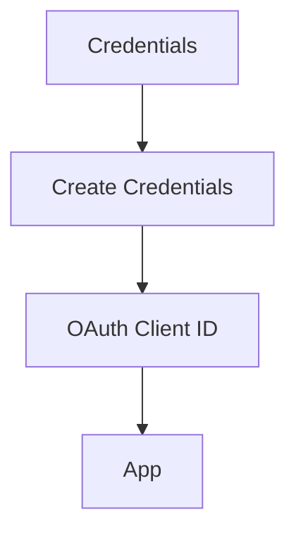

# social-spammers-detection - YouTube Spam Comment Remover (Rust)

A Rust implementation to automatically remove spam comments from your YouTube videos using the YouTube Data API v3.

## 🛠️ Setup Guide

### Step 1: Create Project Structure
```bash
mkdir social-spammers-detection
cd social-spammers-detection
code .
```

### Step 2: Initialize Rust Project
```bash
cargo init
```

## ⚙️ Configuration

### 1. Enable YouTube Data API
1. Go to [Google Cloud Console](https://console.cloud.google.com/)
2. Create new project
3. Enable YouTube Data API v3:
   - Navigation → "APIs & Services" → "Library"
   - Search for "YouTube Data API v3" → Enable

### 2. Create OAuth Credentials


Save as `credentials.json` in project root.

### 3. Environment Setup
Create `.env` file:
```env
YOUTUBE_CHANNEL_ID=your_channel_id_here
GOOGLE_APPLICATION_CREDENTIALS=./credentials.json
```

## 📦 Dependencies
Add to `Cargo.toml`:
```toml
[dependencies]
google-youtube3 = "2.0.0"
dotenv = "0.15.0"
tokio = { version = "1.0", features = ["full"] }
yup-oauth2 = "6.0"
```

Install with:
```bash
cargo build
```

## 🚀 Running the Program
```bash
cargo run
```

Follow the OAuth flow:
1. Copy authorization URL from console
2. Paste code after redirect
3. Program will begin processing

## ⚠️ Important Notes
1. **API Quotas**: 
   - 10,000 quota units/day limit
   - Monitor usage in [Cloud Console](https://console.cloud.google.com/apis/dashboard)

2. **Authentication**:
   - First run creates `token.json`
   - Delete this file to force re-authentication

3. **Channel ID**:
   Find yours at:  
   `https://www.youtube.com/account_advanced`

## 📄 License
Apache 2.0 License 
